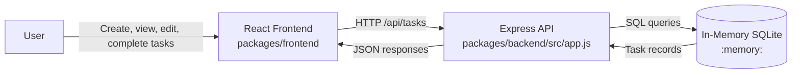
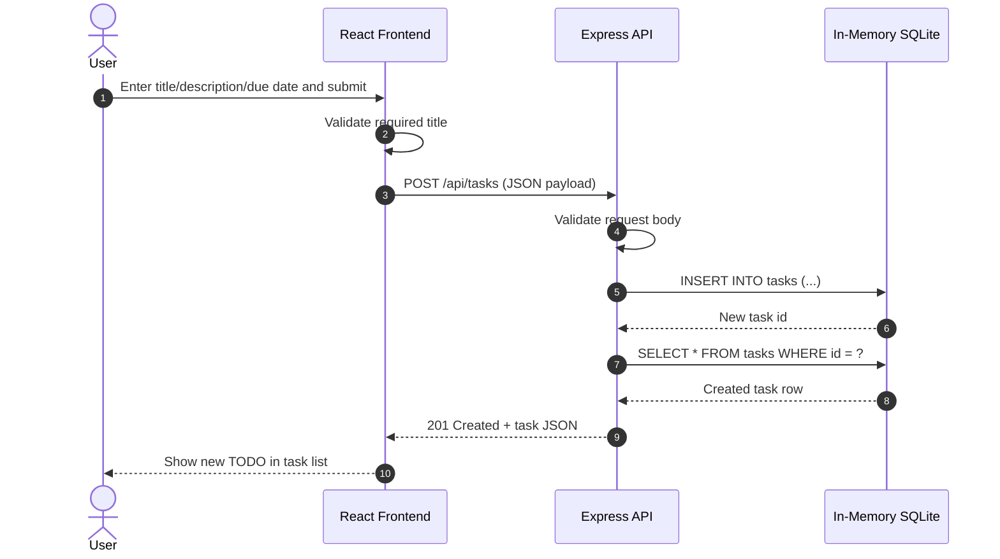

# Context Architecture Overview

This repository uses a simple three-part runtime architecture:
- React frontend for user interaction
- Express API for task operations
- In-memory SQLite store for temporary data persistence during runtime

## Sequence: Create TODO

## Notes
- The backend store is in-memory, so data resets when the server restarts.
- Frontend and backend communicate over REST endpoints under `/api/tasks`.
